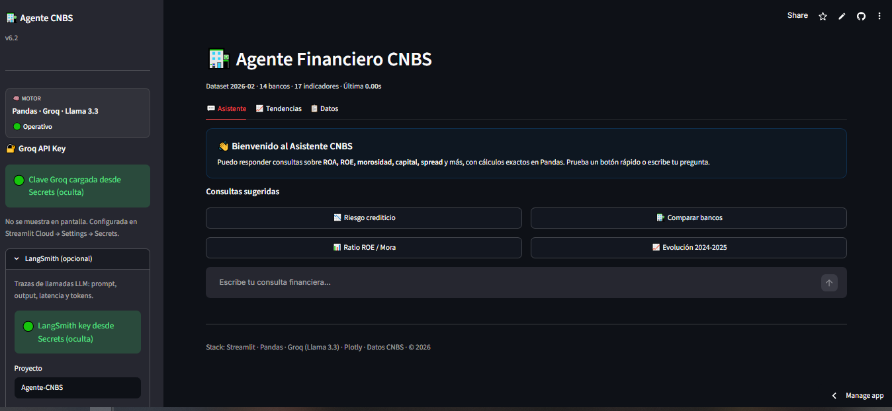
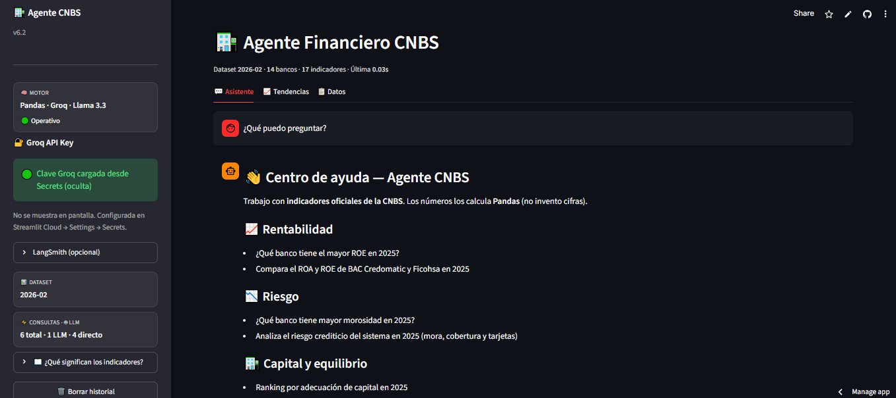
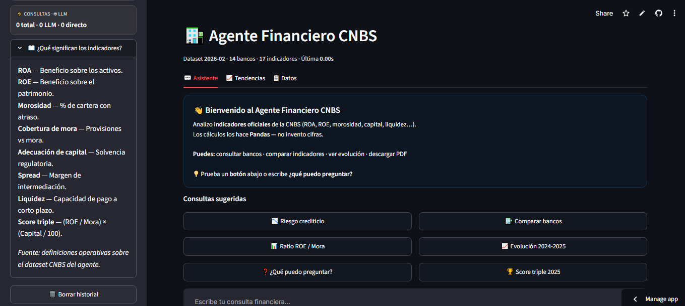
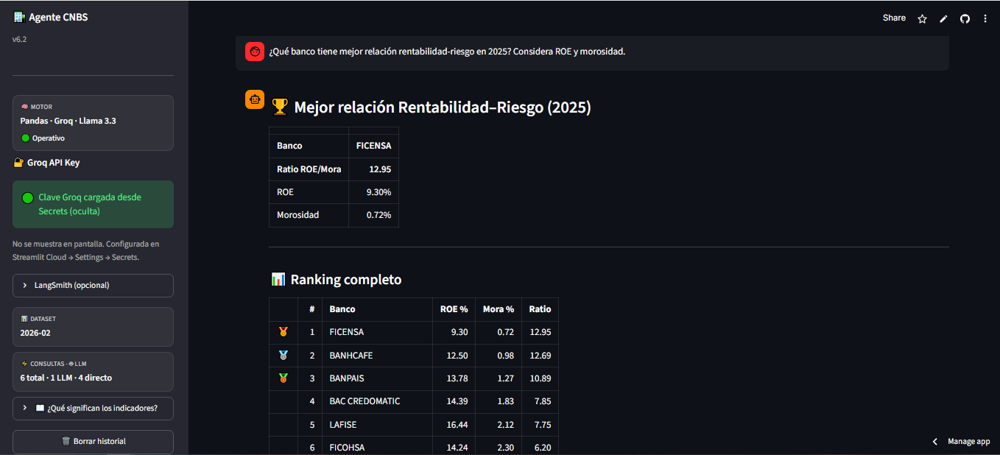
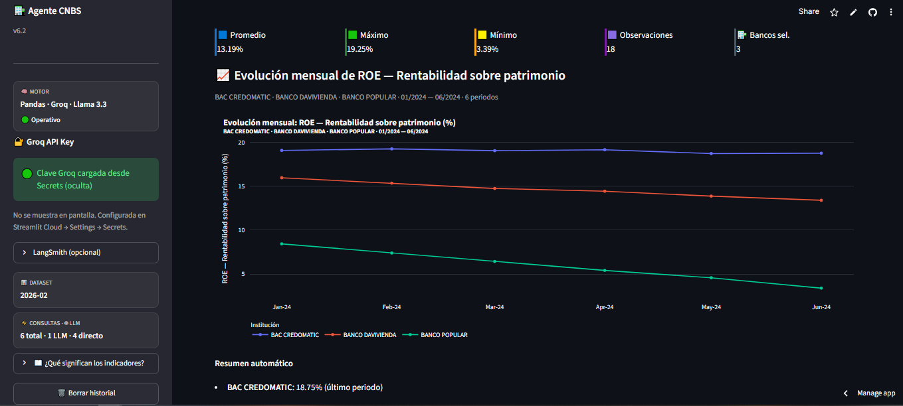
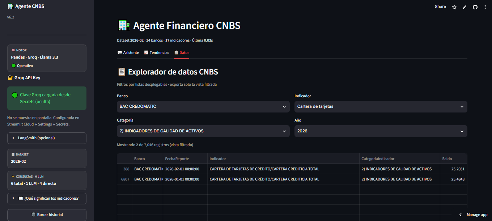
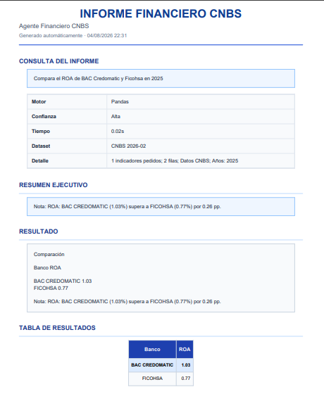
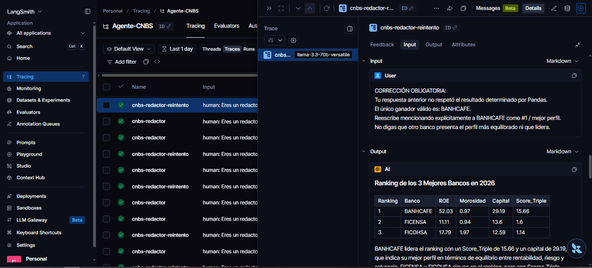

# Agente Financiero CNBS

**Asistente analítico del sistema bancario hondureño** con indicadores oficiales de la Comisión Nacional de Bancos y Seguros (CNBS).

Motor híbrido basado en **Pandas** y **Groq (Llama 3.3)**: Pandas realiza los cálculos determinísticos y el modelo de lenguaje únicamente genera explicaciones en lenguaje natural, con validación anti-alucinación.

[](https://www.python.org/)
[](https://streamlit.io/)
[](https://pandas.pydata.org/)
[](https://groq.com/)
[](https://plotly.com/)
[](https://www.reportlab.com/)
[](LICENSE)


<!-- Captura principal del dashboard (coloca la imagen en docs/) -->


---

## Resultados del proyecto

| Métrica | Valor |
|---------|--------|
| Bancos analizados | **14** |
| Indicadores financieros | **17** |
| Registros históricos | **~7,046** |
| Periodos mensuales | **~26** (p. ej. 2024–2026) |
| Exportación PDF | Informes del asistente y de tendencias |
| Exportación PNG | Gráficos de series temporales |
| Exportación Excel / CSV | Vista filtrada del explorador de datos |
| Motor | Híbrido **Pandas + Groq (Llama 3.3)** |
| Trazabilidad | LangSmith · integrado (opcional al clonar) |

---

## Tecnologías

| Capa | Herramientas |
|------|----------------|
| Lenguaje | Python 3.10+ |
| Interfaz | Streamlit |
| Datos y cálculo | Pandas |
| Visualización | Plotly · Kaleido (PNG) |
| LLM | Groq · Llama 3.3 70B · LangChain |
| Informes | ReportLab (PDF) · OpenPyXL (Excel) |
| Observabilidad | LangSmith *(opcional)* |

---

## Características técnicas

- Arquitectura híbrida **Pandas + LLM** (cálculo y redacción desacoplados)
- Cálculo **determinístico** de rankings, ratios y scores
- **Validación anti-alucinación** (ganador, ranking y cifras)
- Score de equilibrio triple: `(ROE / Morosidad) × (Capital / 100)`
- Ranking ROE / morosidad
- Hallazgos automáticos en tendencias (solo Pandas)
- Consultas conversacionales (fecha, saludo) **sin** consumir tokens
- **Centro de ayuda** (`¿qué puedo preguntar?`, glosario, ejemplos) sin Pandas ni LLM
- Bienvenida guiada y botones de consultas sugeridas
- Exportación **PDF**, **PNG**, **Excel** y **CSV**
- Trazas **LangSmith** (integrado; opcional si clonas el repo sin API key)

---

## ¿Cómo evita alucinaciones?


El LLM **nunca calcula**.

1. Todo cálculo financiero (promedios, rankings, ratios, scores) se realiza con **Pandas** sobre el CSV de la CNBS.
2. El modelo **solo redacta** la explicación a partir de un contexto ya calculado.
3. Antes de mostrar la respuesta se valida:
   - banco ganador
   - orden del ranking
   - ratios y scores
   - cifras presentes en el DataFrame
4. Si hay discrepancia, la respuesta se **reintenta o se corrige** de forma automática.

```text
Pregunta
   │
   ▼
 Pandas  ── calcula todo (rankings, ratios, scores)
   │
   ▼
 DataFrame de resultado
   │
   ├── respuesta directa (tablas / rankings)
   │
   └── si hace falta explicar
           │
           ▼
        LLM (solo redacta)
           │
           ▼
        Validador (ganador · cifras)
           │
           ▼
        UI / PDF
```

Ese patrón es el diferenciador del proyecto frente a un chatbot que “estima” indicadores.

---

## Características

| Módulo | Descripción |
|--------|-------------|
| **💬 Asistente** | Consultas en lenguaje natural: ROA, ROE, morosidad, capital, spread, liquidez, rankings y comparaciones |
| **📈 Tendencias** | EDA interactivo: series temporales, KPIs y hallazgos automáticos generados solo con Pandas |
| **📋 Datos** | Explorador del dataset CNBS con export Excel/CSV de la vista filtrada |

### Capacidades analíticas

- Ranking **ROE / morosidad** y **score de equilibrio triple**  
  `Score = (ROE / Morosidad) × (Capital / 100)`
- Comparaciones multi-banco y multi-indicador
- Evolución temporal (p. ej. 2024 vs 2025)
- Panel de riesgo crediticio (mora, cobertura, cartera de tarjetas)
- Respuestas cortas a charla (fecha, saludo) **sin** tokens de Groq
- **Centro de ayuda** y glosario de indicadores (sidebar) para usuarios nuevos

---

## Ejemplo de conversación

**Usuario**

> ¿Qué banco tiene mejor relación rentabilidad-riesgo en 2025? Considera ROE y morosidad.

**Asistente**

> **FICENSA** presenta la mejor relación rentabilidad–riesgo en 2025  
> (Ratio ROE/Mora = **12.95**).
>
> | # | Banco | ROE % | Mora % | Ratio |
> |---|--------|-------|--------|-------|
> | 1 | FICENSA | 9.30 | 0.72 | **12.95** |
> | 2 | BANHCAFE | 12.50 | 0.98 | 12.69 |
> | 3 | BANPAIS | 13.78 | 1.27 | 10.89 |
>
> Motor: **Pandas** · Confianza: Alta · ~0.02 s

**Usuario**

> Analiza el ranking de los 5 mejores bancos en 2025 según el score de equilibrio (ROE, morosidad y capital).

**Asistente**

> Ganador determinístico: **BANHCAFE** (Score triple ≈ **2.79**).  
> Tabla con ROE, mora, capital y score · justificación alineada con Pandas (+ LLM solo si se pide análisis detallado).

---

### Ejemplo: panorama del sistema en un año

**Usuario**

> Dame datos de 2025

**Asistente**

> **Comparación**
>
> | Banco | ROA | ROE | Mora | Capital | Spread | Liquidez |
> |-------|-----|-----|------|---------|--------|----------|
> | Sistema bancario | 0.55 | 5.65 | 3.56 | 15.23 | 9.54 | 37.72 |
>
> Motor: **Pandas** · Confianza: Alta · ~0.03 s · Datos CNBS 2026-02

---

## Capturas de pantalla

| Módulo | Vista |
|--------|--------|
| Centro de Ayuda |  | 
| Glosario |  |
| Asistente |  |
| Tendencias |  |
| Datos |  |
| Informe PDF |  |

---

## Cómo preguntar al asistente

El motor prioriza rutas según el tipo de consulta. Para obtener el resultado que esperas, conviene ser explícito:

| Quieres… | Ejemplo de pregunta |
|----------|---------------------|
| Ranking por morosidad | `Ranking de morosidad en 2025` |
| Mejor relación ROE / mora | `¿Qué banco tiene mejor relación rentabilidad-riesgo en 2025?` |
| Score triple (ROE + mora + capital) | `Compara AZTECA, BAC y FICOHSA en 2025 con ROE, morosidad y capital. ¿Quién tiene el mejor equilibrio?` |
| **Solo adecuación de capital** | `Ranking por adecuación de capital en 2025` |
| ROA / ROE de un banco | `¿Cuál fue el ROA de Ficohsa en 2025?` |
| Comparar bancos en un indicador | `Compara el ROA de BAC y Ficohsa en 2025` |
| Evolución temporal | `Compara la evolución del ROA y ROE del sistema entre 2024 y 2025` |
| Riesgo crediticio del sistema | `Analiza el riesgo crediticio del sistema en 2025 (mora, cobertura y tarjetas)` |
| Panorama del sistema | `Dame datos de 2025` |
| **Centro de ayuda** | `¿Qué puedo preguntar?` · o escribe solo `ROA` |

**Importante:** si mencionas a la vez ROE, morosidad y capital (o hablas de “equilibrio”), el agente usa el **score triple**, no un ranking solo por capital. Para ordenar **únicamente** por adecuación de capital, no menciones ROE ni morosidad en la misma pregunta.

---


---

## Centro de ayuda (usuarios nuevos)

Si no conoces los indicadores o no sabes cómo consultar, el agente responde **sin** llamar a Pandas ni a Groq:

| Entrada | Respuesta |
|---------|-----------|
| `¿Qué puedo preguntar?` / `ayuda` | Guía con ejemplos por tema (rentabilidad, riesgo, capital, evolución) |
| Solo `ROA`, `ROE`, `mora`, etc. | Definición corta + ejemplos de pregunta |
| Primera visita (sin historial) | Mensaje de bienvenida + botones sugeridos |

En el **sidebar** hay un expander **¿Qué significan los indicadores?** (ROA, ROE, morosidad, cobertura, capital, spread, liquidez, score triple).

## Arquitectura del motor

```text
                 ┌──────────────────────┐
                 │   Streamlit (UI)     │
                 │ Asistente·Tendencias │
                 │        ·Datos        │
                 └──────────┬───────────┘
                            │
              ┌─────────────┴─────────────┐
              ▼                           ▼
     Ayuda / charla              Consulta financiera
     (guía, glosario, fecha)              │
     (sin Pandas / sin LLM)               │
                                          ▼
                               Clasificador de intención
                               planificar / es_consulta_*
                                          │
                    ┌─────────────────────┼─────────────────────┐
                    ▼                     ▼                     ▼
              Ranking               Comparar              Serie / promedio
           ROE-Mora / Triple      multi-indicador           temporal
                    │                     │                     │
                    └─────────────────────┴─────────────────────┘
                                          │
                                          ▼
                                   ┌─────────────┐
                                   │   Pandas    │
                                   │  (cálculo)  │
                                   └──────┬──────┘
                                          │
                           ┌──────────────┴──────────────┐
                           ▼                             ▼
                    Respuesta directa              ¿Necesita LLM?
                    (tablas / rankings)           Sí            No
                                                   │
                                                   ▼
                                            Groq Llama 3.3
                                            (solo redacción)
                                                   │
                                                   ▼
                                              Validador
                                           ganador · cifras
                                                   │
                                                   ▼
                                          UI + PDF / PNG / Excel
```

**Stack:** Streamlit · Pandas · Plotly · Groq (Llama 3.3 70B) · ReportLab · LangSmith

---

## 🔍 Trazabilidad y Observabilidad (LLMOps)

Para garantizar la robustez del motor híbrido y auditar el comportamiento del modelo, el proyecto puede integrar **LangSmith** (activado en el despliegue de demostración). Esto permite realizar un seguimiento detallado de cada traza, midiendo la latencia, el consumo de tokens y la eficacia de los flujos de reintento.

La siguiente captura muestra una ejecución real del mecanismo de **corrección automática**. Cuando el redactor intenta apartarse del resultado estricto, el validador intercepta la salida, emite una directiva de corrección obligatoria y fuerza una nueva iteración alineada con la matemática de Pandas:


**LangSmith · nodo `cnbs-redactor-reintento`: el validador fuerza al LLM a respetar el ganador fijado por Pandas (BANHCAFE).**

---

## Estructura del repositorio

```text
agente-financiero-cnbs/
├── app.py                              # UI + motor híbrido
├── pdf_renderer.py                     # Informes PDF
├── indicadores_financieros_CNBS.csv    # Dataset CNBS
├── requirements.txt
├── README.md
├── LICENSE                             # MIT
├── docs/                               # Capturas para el README
│   ├── dashboard.png                   # o asistente_respuesta.png
│   ├── tendencias.png
│   ├── datos.png
│   ├── informe_pdf.png
│   └── langsmith_trace.png             # traza de reintento / gobernanza
└── .streamlit/
    └── secrets.toml                    # No versionar (solo en Cloud / local)
```

---

## Instalación local

```bash
git clone https://github.com/<tu-usuario>/agente-financiero-cnbs.git
cd agente-financiero-cnbs

python -m venv .venv
source .venv/bin/activate          # Windows: .venv\Scripts\activate

pip install -r requirements.txt
streamlit run app.py
```

### API Key

**Streamlit Secrets (recomendado)**

```toml
# .streamlit/secrets.toml  — no subir a Git público
GROQ_API_KEY = "gsk_..."

# Opcional — LangSmith
LANGCHAIN_API_KEY = "lsv2_..."
LANGCHAIN_TRACING_V2 = "true"
LANGCHAIN_PROJECT = "Agente-CNBS"
```

También puedes pegar la clave en el **sidebar** de la app o usar la variable de entorno `GROQ_API_KEY`.

---

## Deploy en Streamlit Community Cloud

### Archivos a subir al repo

| Archivo | Obligatorio |
|---------|-------------|
| `app.py` | Sí |
| `pdf_renderer.py` | Sí |
| `indicadores_financieros_CNBS.csv` | Sí |
| `requirements.txt` | Sí |
| `README.md` | Recomendado |
| `docs/*.png` | Recomendado (README) |

**No subas** `.streamlit/secrets.toml` ni `.env` con claves reales.

### Pasos

1. Publica el repo en GitHub.
2. Entra a [share.streamlit.io](https://share.streamlit.io) y conecta el repositorio.
3. **Main file path:** `app.py`
4. **Settings → Secrets:**

```toml
GROQ_API_KEY = "gsk_tu_clave"
```

5. Deploy → URL tipo `https://<app-name>.streamlit.app`

### `requirements.txt`

```text
streamlit>=1.28.0
pandas>=2.0.0
plotly>=5.18.0
langchain-groq>=0.2.0
langchain-core>=0.3.0
reportlab>=4.0.0
kaleido>=0.2.1
openpyxl>=3.1.0
langsmith>=0.1.0
```

---

## Más ejemplos de consulta

```text
Compara AZTECA, BAC CREDOMATIC y FICOHSA en 2025 (ROA, ROE, mora, capital).
¿Qué banco presenta el perfil más equilibrado?

Analiza el riesgo crediticio del sistema en 2025 (mora, cobertura y tarjetas).

Compara la evolución del ROA y ROE del sistema entre 2024 y 2025.

¿Qué día es hoy?          → respuesta corta, sin Pandas ni LLM
¿Qué puedo preguntar?     → centro de ayuda (0 tokens)
ROA                      → mini-glosario + ejemplos
```

---


## Rendimiento

| Métrica | Valor |
|---------|--------|
| Consultas determinísticas (solo Pandas) | ~0.02 s |
| Consultas con LLM (redacción) | ~1–2 s |
| Dataset | ~7,046 registros |
| Bancos | 14 |
| Indicadores | 17 |
| Periodos mensuales | ~26 |

---

## Limitaciones

- Analiza **únicamente** los indicadores presentes en el dataset oficial de la CNBS.
- **No** realiza predicciones financieras ni proyecciones a futuro.
- **No** sustituye análisis ni dictámenes regulatorios oficiales.
- Si el dataset no contiene información suficiente para una consulta, el sistema informa que **no hay datos disponibles** (no inventa cifras).
- El dataset no incluye montos absolutos de activos o cartera; solo ratios y porcentajes.

---

## Aprendizajes

Durante el desarrollo del proyecto se aplicaron y consolidaron:

- Arquitecturas híbridas **Pandas + LLM**
- Ingeniería de prompts y gobernanza del modelo
- Validación **anti-alucinación** en datos financieros
- Detección de intención y enrutamiento de consultas
- Streamlit (UI, sesión, exports)
- Pandas (cálculo determinístico y rankings)
- Plotly y Kaleido (visualización y PNG)
- ReportLab (informes PDF)
- LangChain + Groq (Llama 3.3)
- Observabilidad con LangSmith
- Procesamiento ligero de lenguaje natural sobre consultas financieras
- UX de onboarding (ayuda, glosario, bienvenida) sin coste de tokens

---

## Dataset

Indicadores publicados por la **CNBS (Honduras)**: ratios y porcentajes por institución y fecha de reporte.

> El dataset no incluye montos absolutos de activos o cartera; solo indicadores relativos (%).

---

## Licencia

Distribuido bajo **MIT License**.  
Proyecto desarrollado con fines educativos, demostración técnica y portafolio profesional. Los datos pertenecen a la **Comisión Nacional de Bancos y Seguros (CNBS)**; este proyecto no sustituye dictámenes regulatorios oficiales.

```text
MIT License — ver archivo LICENSE
```

---

## Créditos

- **Datos:** Comisión Nacional de Bancos y Seguros (CNBS), Honduras
- **Stack:** Streamlit · Pandas · Plotly · Groq · ReportLab · LangSmith
- **Versión:** Agente Financiero CNBS v6.3 · Euraque Analytics
